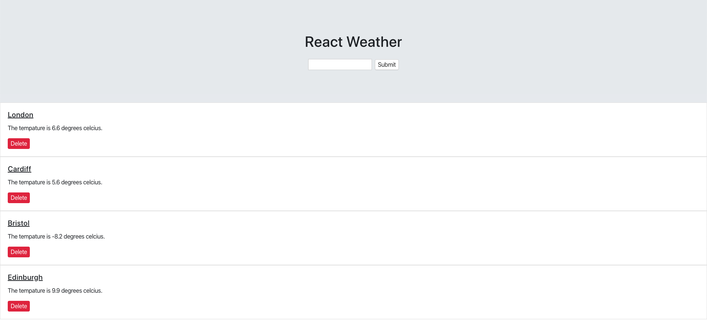

# React-Weather-App

### About
This is a sample project using React.js and OpenWeatherMap API.

### Instructions
1. Clone Repo (if required)
2. Run 'npm start'

---
This project was bootstrapped with [Create React App](https://github.com/facebook/create-react-app).

