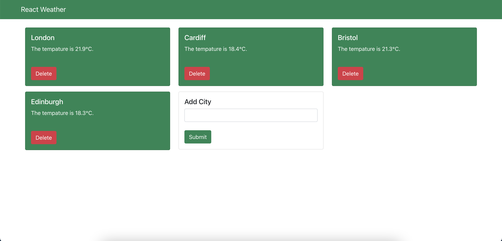

# React Weather

Aim: Create a sample project using React.js and OpenWeatherMap API.



## Overview

React Weather uses two docker containers:

- React Frontend (using NGINX Reverse Proxy)
- Go Backend

## Requirements

- A Current Weather Data API Key from [Open Weather Map](https://openweathermap.org/)

## Deployment Guide

Note: Currently the publishing of images and charts is a manual process. In Phase 2, I plan to use GitHub Actions to automate this process.

Since I store the source code in GitHub, I have opted to store the images inside GitHub Container Registry.

### Images

The building and publishing of the Docker images is performed using the `./build.sh` script. This script builds 2 images:
- ghcr.io/benlewsey27/react-weather-api:$backendVersion
- ghcr.io/benlewsey27/react-weather:$frontendVersion

where:
- `backendVersion` is the version value inside `./backend/VERSION`
- `frontendVersion` is the version value inside `./frontend/package.json`

### Helm Chart

The building and publishing of the Helm chart is performed using the following commands:

```bash
helm package ./charts/react-weather
helm push react-weather-<version>.tgz oci://ghcr.io/benlewsey27/charts
```

### Sample Deployment

I have provided a sample deployment to provide instructions for deploying this project to a Kubernetes cluster. It is assumed you have access to working images and charts in a remote registry. I am using GitHub Container Registry in this example.

More information can be found in the `./docs/deployment.md` file.

## Roadmap

Phase 1
- [X] Write Initial K8s Deployment Guide
- [X] Improve Helm Chart Env Var Templating
- [X] Check default values in chart
- [X] Release non-rc images and chart to Ghcr
- [X] Deploy HelmRelease via helmfile/GitOps

Phase 2
- [ ] Release image to Ghcr through GitHub Actions

Phase 3
- [ ] Improve Backend Logging
- [ ] Improve Error Message on FE (always shows error code 404, when error is 500)

Phase 4
- [ ] Use nx for monorepo structure


ghcr.io/benlewsey27/react-weather:03451eb6
ghcr.io/benlewsey27/react-weather-api:03451eb6

feature/XXX (PR) -> image: 03451eb6, chart: 0.4.0
main -> image: 2024.02-03451eb6, chart: 0.4.0

create tag on main with release version (e.g. 2024.02)
