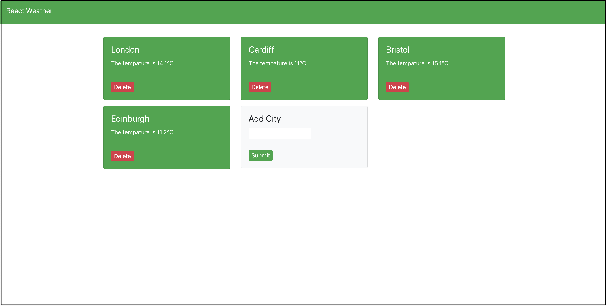

# React Weather
Aim: Create a sample project using React.js and OpenWeatherMap API.

[](#)

## Run Local
``` bash
export REACT_APP_WEATHER_API_KEY = <OPEN WEATHER MAP API KEY>
docker-compose build
docker-compose up

# Open on https://localhost:3000
```

This project was created with [Create React App](https://github.com/facebook/create-react-app).